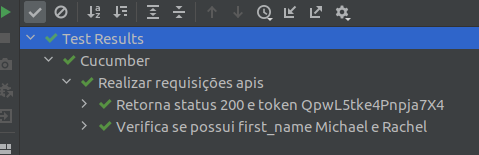

# Cucumber

[Cucumber Expressions](https://cucumber.io/docs/cucumber/cucumber-expressions/)

Concorrente do Cucumber: JBehave


## Plugin IntelliJ

  - Instalar plugin 'Cucumber for Java'
  

## Execução dos testes

Executar um dos arquivos:

  - bdds.feature
  
  - Executor.java 


## Testando

  - De forma fixa:

```java
    @Entao("^deve ser retornado o first_name \"Michael\" e \"Rachel\"$")
    public void deve_ser_retornado_o_first_name_Michael_e_Rachel() throws Throwable {
        given().
            params("page", pagina).
        when().
            get(baseURI).
        then().
            statusCode(200).
            body( "data.first_name", hasItems("Michael", "Rachel"));
    }
  
```  

  - De forma dinâmica, parametrizável:

```java

    @Entao("^deve ser retornado o first_name \"(.*?)\" e \"(.*?)\"$")
    public void deve_ser_retornado_o_first_name_Michael_e_(String michael, String rachel) throws Throwable {
        given().
            params("page", pagina).
        when().
            get(baseURI).
        then().
            body("data.first_name", hasItems(michael, rachel));
    }

```

## Output

    